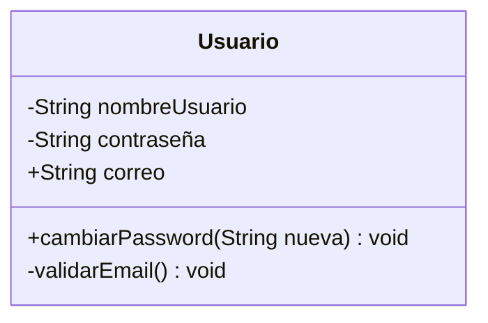
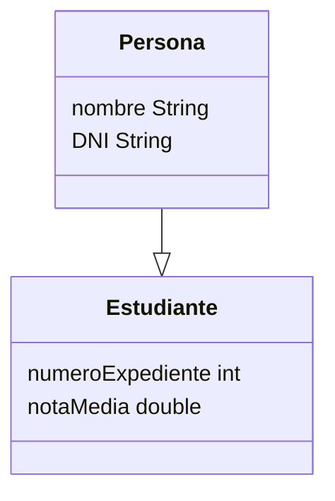
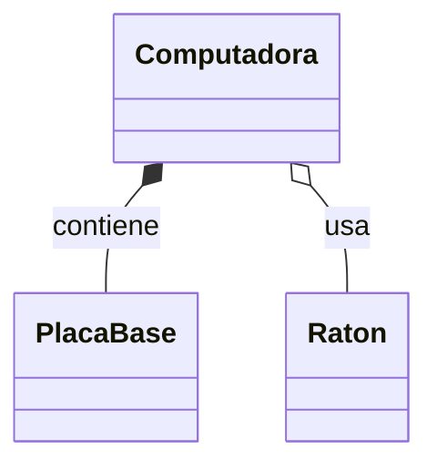
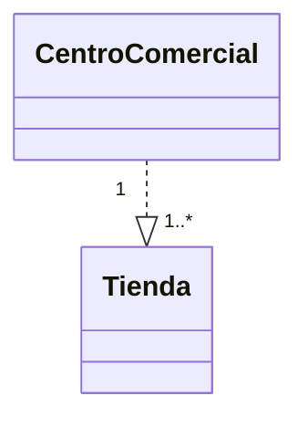
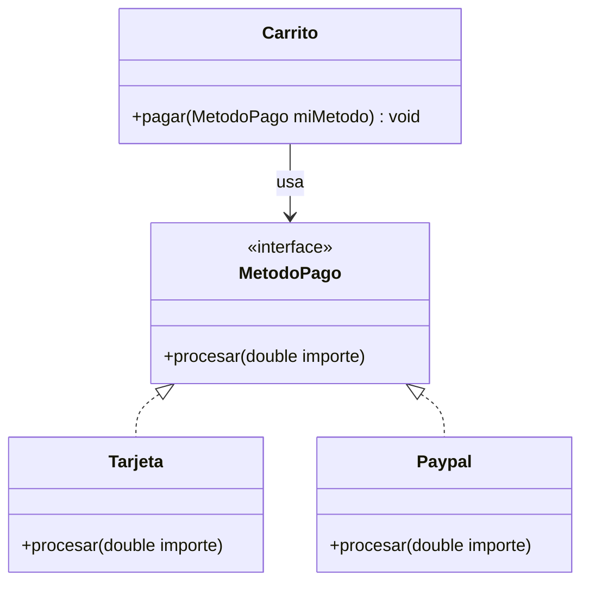
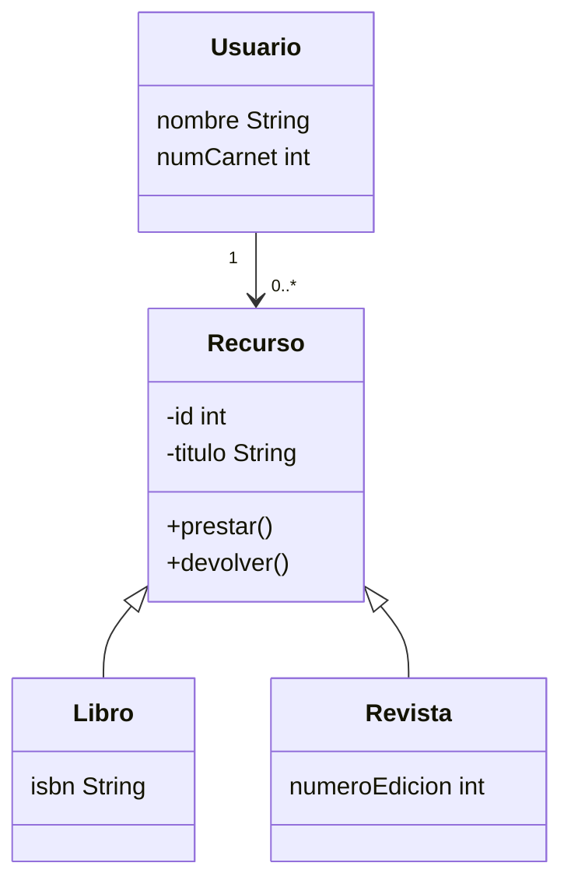

# 6.2.BateriaDeEjercicios
EJERCICIO 1:

```mermaid
classDiagram
    class Usuario {
        -String nombreUsuario
        -String contraseña
        +String correo
        +cambiarPassword(String nueva) void
        -validarEmail() void
    }
```
EJERCICIO 2:

```mermaid
classDiagram
    class Persona {
        nombre String
        DNI String
    }

    class Estudiante {
        numeroExpediente int
        notaMedia double
    }

    Persona --|> Estudiante
```
EJERCICIO 3:

```mermaid
classDiagram
    class Computadora{
}
    class PlacaBase{
}
    class Raton{
}
    %% Composición (fuerte)
    Computadora *-- PlacaBase : contiene

    %% Agregación (débil)
    Computadora o-- Raton : usa
```
EJERCICIO 4:

```mermaid
classDiagram
    class CentroComercial {
    }

    class Tienda {
    }

    CentroComercial "1" ..|> "1..*" Tienda
```
EJERCICIO 5:

```mermaid
classDiagram
    class MetodoPago {
        <<interface>>
        +procesar(double importe)
    }

    class Tarjeta {
        +procesar(double importe)
    }

    class Paypal {
        +procesar(double importe)
    }

    class Carrito {
        +pagar(MetodoPago miMetodo) void
    }

    MetodoPago <|.. Tarjeta
    MetodoPago <|.. Paypal
    Carrito --> MetodoPago : usa
```
EJERCICIO 6:

```mermaid
classDiagram
    class Recurso {
        -id int
        -titulo String
        +prestar()
        +devolver()
    }

    class Libro {
        isbn String
    }

    class Revista {
        numeroEdicion int
    }

    class Usuario {
        nombre String
        numCarnet int
    }

    Recurso <|-- Libro
    Recurso <|-- Revista

    Usuario "1" --> "0..*" Recurso 
```

